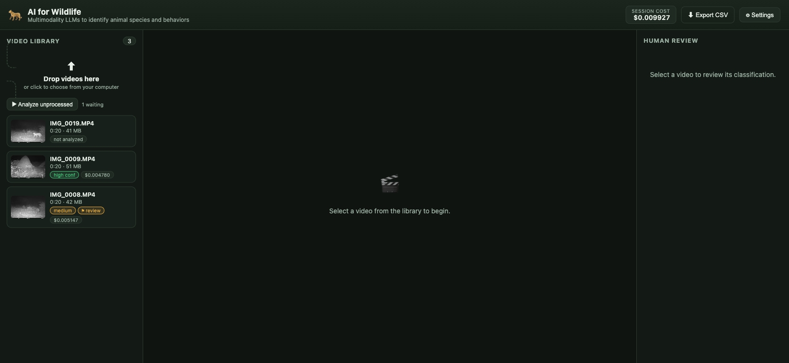

# AI for Wildlife

*Multimodality LLMs to identify animal species and behaviors — built for the Cheetah Conservation Fund.*

Upload wildlife videos, classify **species + behavior** automatically with several
multimodal LLMs at once (via OpenRouter), and let a human reviewer confirm or correct
the result. When the models agree you get high confidence; when they disagree the clip
is flagged for human review. Per-clip **token usage and cost** are shown throughout.



## How it works

1. **Batch upload** videos (drag & drop, or click to choose). By default each clip is sent
   to the models as **native video** (transcoded to a small mp4); a frame-sampling mode is
   also available (see "input mode" below).
2. The frames are sent to **each selected model in parallel** through OpenRouter with a
   structured wildlife-ID prompt; each returns species (common + scientific), behavior,
   individual count, its own confidence, and notes.
3. A **consensus** is computed by normalizing and comparing the models' species/behavior:
   - all models agree → **high confidence**
   - a majority agree → **medium** (review recommended)
   - they disagree → **low** → **flagged for human review**
4. A reviewer **approves, corrects, or flags** the result in the right-hand panel.
5. Everything (predictions, consensus, review, tokens, cost) exports to **CSV**.

## Layout (answers to the design questions)

- **Left column** — video library + batch upload. Click a clip to play it; badges show
  status (analyzing / confidence level / ⚑ review / reviewed) and per-clip cost.
- **Center column** — player + **one card per model side-by-side** so you can compare all
  selected models at a glance, under a **consensus banner**. Green dot = agrees with
  consensus, red dot = differs.
- **Right column** — the **human review panel** (its own column, as recommended): final
  species/behavior + reviewer notes, pre-filled from the consensus, with Approve / Save
  correction / Flag. "↳ Use this" on any model card copies its answer into the form.
- **Top bar** — running **session cost**, CSV export, and Settings (model picker +
  frames-per-video).

## Review workflow (triage)

The whole point is to let the AI handle the easy majority so humans review only the
uncertain minority. Each clip has one **workflow status**, shown as a single badge and as
**filter tabs** in the library:

- **Not analyzed** — no models have run yet.
- **✓ Confident** — models agree enough to auto-accept the label (no review needed).
- **⚑ Needs review** — models disagree; a human should decide. *This is the work queue.*
- **✓ Reviewed** — a human has confirmed/corrected it (done). The badge shows the final
  species.

How aggressively clips get sent to review is tunable in **Settings → "When should a clip
be sent to human review?"**:
- **Only when models disagree** (default) — auto-accept on a species *majority*; reviewers
  focus on the ~20% with no clear winner.
- **Whenever they're not unanimous** — stricter; any disagreement goes to review.

**Saving a review** gives immediate feedback: a toast, the banner flips to "Reviewed", the
model card(s) you agreed with get a green **"✓ matches your review"** tag, and the library
badge + filter counts update. Re-running models keeps the human label (ground truth) and
re-checks which models now match it.

## Model accuracy scoreboard

The **📊 Model accuracy** button (top bar) scores every model against your saved reviews:
for each reviewed clip it compares the model's prediction to your *final* answer and shows
**species match %**, **behavior match %**, **$ / correct ID**, and avg latency — ranked
best-first. It's computed live from the database, so it's always in sync.

This is the empirical way to answer "which model is best for *our* footage?" (vs. generic
benchmarks), and it's the reward signal the planned adaptive model-picker will learn from
(see `ROADMAP.md`).

## Setup

Requires **Python 3.11+** and **ffmpeg** (`brew install ffmpeg`).

```bash
# 1. Put your OpenRouter key in .env  (already gitignored)
echo 'OPENROUTER_API_KEY=sk-or-v1-...' > .env

# 2. Run (creates a venv + installs deps on first run)
./run.sh
```

Then open **http://localhost:8000**.

The API key is read **only** from `.env` at startup — it is never entered or stored
through the UI. Edit `.env` and restart to change it.

## Choosing models

**Settings → "Which models analyze each video":**

- **Auto (default, recommended)** — compares a fixed trusted trio, nothing to configure:
  `google/gemini-2.5-flash`, `qwen/qwen3-vl-235b-a22b-instruct`, `minimax/minimax-m3`.
- **Custom** — "Load available models" to pick from the full vision catalog (prices
  shown), or type a custom model name.

The active models are always shown in the center column with a **Change…** shortcut.

## How the clip reaches the model (input mode)

Settings → **"How the clip is sent to the models"**:

- **Native video (default)** — the actual clip is transcoded to a small ~480p mp4 and sent
  as **native video input**, so models use their real temporal/video understanding (best
  for behavior). Only video-capable models (the 43 in the picker) support this. OpenRouter's
  video format differs per provider (Google uses a `file` part, others `video_url`); the app
  routes automatically and falls back to the other format on error. Costs more than frames
  (video is tokenized heavily by some models — the scoreboard tracks $/clip).
- **Frame sampling** — extracts evenly-spaced, timestamped stills and sends them as images.
  Works with any image model, cheaper, but loses motion between frames. Frame count is
  tunable (4–24, default 16).

Either way, two measures keep **behavior** labels from diverging across models:

1. **Controlled behavior vocabulary (ethogram)** — models must pick one category from a
   fixed list (`foraging/feeding`, `walking`, `resting`, `vigilance/alert`, …) with free
   text for nuance. This is what stops one model saying "walking away" and another
   "foraging" for the same clip.
2. In frame mode, frames are **timestamped** (`t≈3.1s`) so the model reasons about order.

Batch analysis is capped at **10 clips per run** (configurable: `MAX_BATCH_ANALYZE`).

## API

| Method | Path | Purpose |
|---|---|---|
| `POST` | `/api/videos` | Batch upload (multipart `files`) |
| `GET`  | `/api/videos` | List with consensus + cost |
| `GET`  | `/api/videos/{id}` | Full detail: analyses, consensus, totals, review |
| `POST` | `/api/videos/{id}/analyze` | Run `{models:[...]}` and store results |
| `POST` | `/api/videos/{id}/review` | Save human review |
| `GET`  | `/api/models` | OpenRouter vision models (live) |
| `GET`  | `/api/export.csv` | Export all classifications |

## Stack

FastAPI + SQLite + ffmpeg backend; zero-build static SPA frontend (no `npm`).
Data lives in `data/` (uploads, extracted frames, thumbnails, `app.db`).
